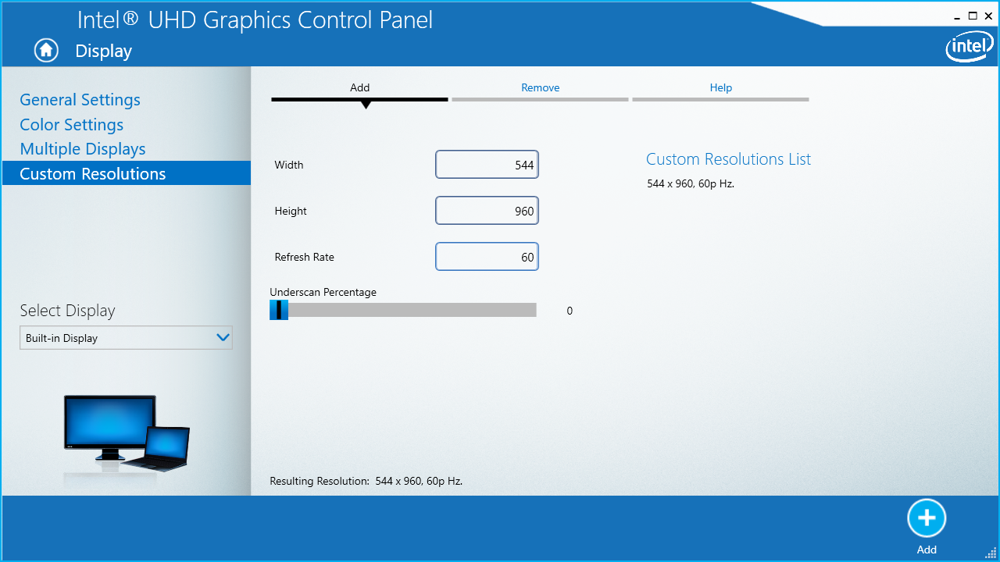

## Custom Screen Resolutions

Setting a **custom lower screen resolution** may improve performances of full-screen games.

> **IMPORTANT**
> Some games may not recognize resolutions under 720p or simply they will still render graphic at 720p even if the screen resolution is lower. In those cases, avoid using custom resolution or try to tweak the specific game config (google how-to-do per game basis) to allow lower resolutions.

How to create new custom resolutions:

 1. Be sure to have `Intel HD Graphics Control Panel` installed and **NOT** `Intel Graphic Command Center`.
    If you're unsure, check [this guide: **Install Intel HD Graphics Control Panel**](/wiki/Install_Intel_Graphic_Control_Panel.md).

 2. If you have troubles following the next steps, watch [this video](https://youtu.be/5SriCS_UbNw?t=19)

 0. Open`Intel HD Graphics Control Panel` and Navigate to `Display -> Customer Resolutions` and click **Yes**, if a warning message appears

 0. Set **custom Width and Height** with **60hz Refresh Rate** and **0 Underscan Percentage**. [Here](https://pacoup.com/2011/06/12/list-of-true-169-resolutions/) a list of true 16:9 resolutions. **Width and width must be inserted inverted** (e.g. to set 960x544, set 544x960 insted) because the GPD WIN 2 screen is a portrait one.
   Here a list of common custom resolutions:
     * `544x960`: is the most suggested and testedresolution by the community (fun fact: is the same resolution of the PSVita).
     * `540x960`: alternative of the previous resolution with a 16:9 ratio.
     * '648x1152` and`576x1024`: 16:9 resolutions very close to 720p
     * `504x896`: use it only if you really want to squeeze every fps and if supported by your target game. Not suggested.

	

Set this new custom resolutions just before playing with a full-screen game you want to improve performances of.

> **NOTE**:
> If Custom Resolutions don't apply or don't work properly, download and install ab ealier version of Intel graphic drivers. The one I personally tested is v26.20.100.7158. Download it [from Intel website](https://downloadmirror.intel.com/29058/a08/igfx_win10_100.7158.zip)