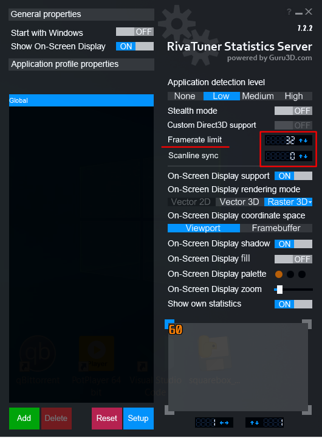

### Framerate Limit

* Advantages:

    * **Extend Battery life** reducing the load on the system. GPD will not compute more FPS than what you consider playable.

    * **Reduce FPS oscillation** between playable and un-playable.
      E.g. if game runs between 24 and 38 FPS, setting 30 as limit, may help the system having 30 FPS consistently over time.

* How to:

    * Install [RivaTuner from its download page](https://www.guru3d.com/files-details/rtss-rivatuner-statistics-server-download.html)

    * Set a Framerate limit to what you consider playable. A good option may be 32 FPS (30 for playability and 2 for buffering)
    
