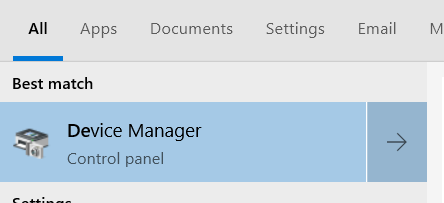
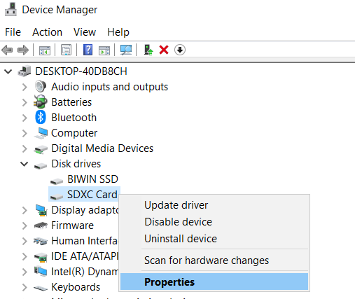
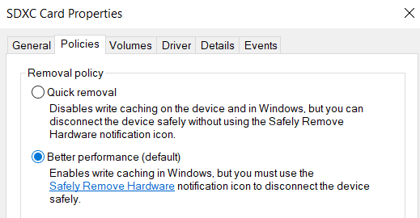

#Hardware Optimizations

## SD Card

This tweak gives better performances to your SD card.
Apply it only if you do not remove the SD often. After applying the change the SD will require a **safety removal** or a system shutdown to be removed.

1. Open the **Start Menu** and type `Device Manager` and click on the result

2. Right click on `Disk drives -> SDXC Card` and select `Properties`

3. Navigate to `Policies` tab and select the `Better performance` option. Then click **OK**

