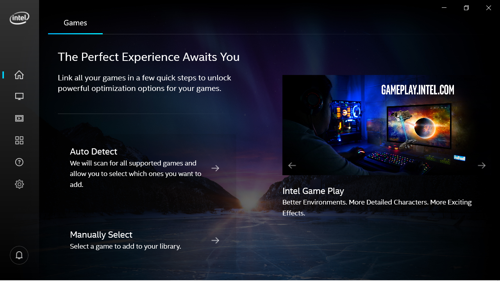
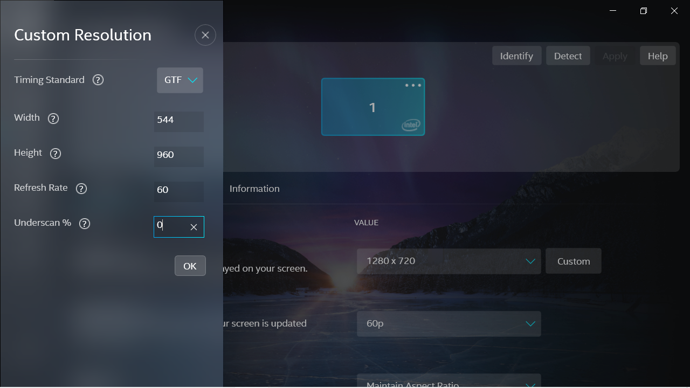
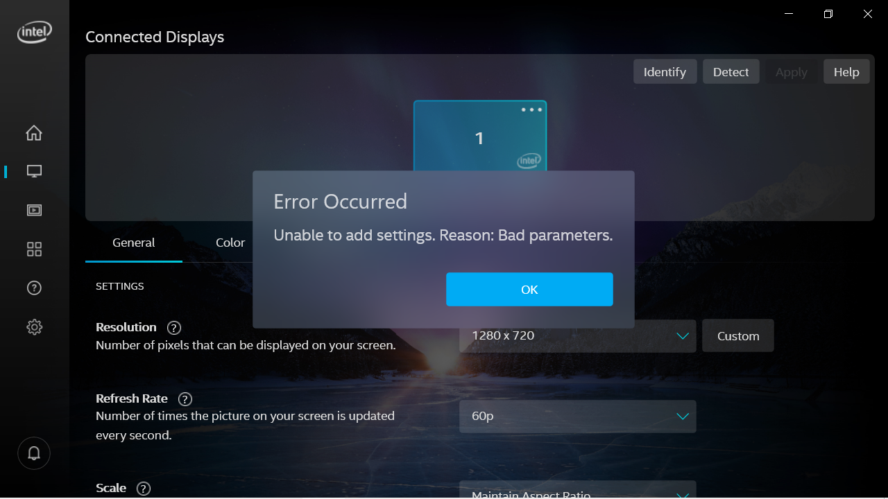
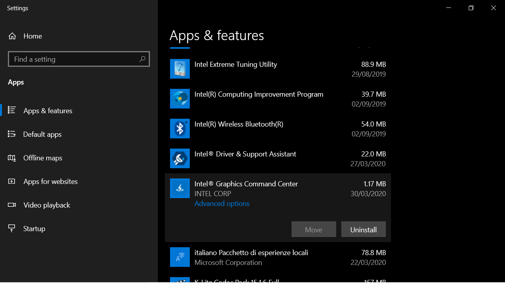
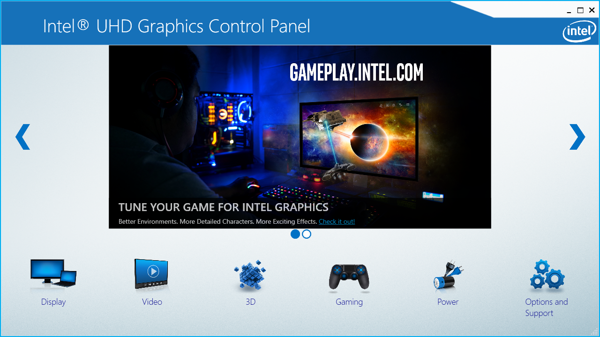

## Intel Graphic Control Panel Installation


### New Intel Graphic Command Center - Issues with Custom Resolution

Nowadays, Intel Driver get installed "alone" or accompanied by the new **Intel Graphic Command Center** that looks like this



At the moment I'm writing, **this software is not able to set custom resolutions on the GPD WIN 2** successfully.
I tried to set all possible **Timing Standars** and inverting width and height but nothing worked. I always get the error
```
Unable to add settings. Reason: Bad Parameters
```

Here is an example:




### Install or Downgrade to the old Intel Graphic Control Panel

The good news is that the old **Intel Graphic Control Panel** seems to able to handle custom resolutions just fine on the GPD WIN 2!
Let's see how to install it:

1. If you already got installed the new **Intel Graphic Command Center**, proceed to remove it. Press Window key and search the **Apps & Features** menu. from there, search for "Graphics Command Center" and click **Uninstall**


2. Install **Install Graphic Control Panel** from the [**Microsoft Store**](https://www.microsoft.com/en-us/p/intel-graphics-control-panel/9ndlclmmtmrc?activetab=pivot%3Areviewstabmicros). If the istallation gets un-reachable, [**here is an alternative offline installation**](/drivers/Intel_Graphic_Control_Panel-Install.appx?raw=true)

3. The **Install Graphic Control Panel** looks like this:
