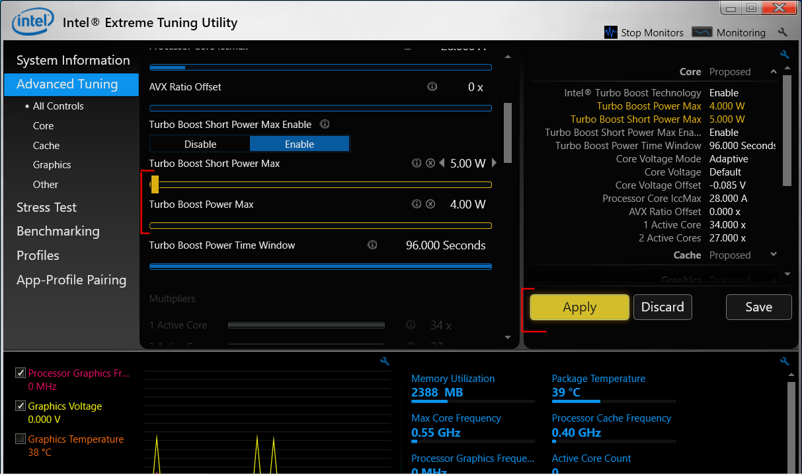

## TDP profiles and Undervolting

**Setting TDP profiles and Undervolting** are fundamental steps for fine **tuning performance, battery life, and heating** of the GPD WIN 2.

### Intel XTU

`Intel XTU (Extreme Tuning Utility)`is the core software  that will allow us **to play with TPD profiles and Undervolt options**.

- [Download the latest version from intel download center](https://downloadcenter.intel.com/download/24075/Intel-Extreme-Tuning-Utility-Intel-XTU) (new version comes without a command line interface)
- Or download an **earlier version that supports commmand line operations** if you wish to use `GPDWin2XTU` or automated `.bat` scripts.
  You can find [the suggested Intel XTU version (6.4.1.25) in the GPDWin2XTU repo](https://github.com/BlackDragonBE/GPDWin2XTUManager/blob/master/XTU_Installer/XTU-Setup-6.4.1.25.exe?raw=true)

### TDP profiles

The GPD WIN 2 can regulate its performace - and consequentially the battery draining - on the CPU & GPU side by limiting the maximum TDP (Maximum Wattage) "usable" by the pair CPU + GPU.
Indirectly, the TDP used, will determine the maximum frequency of the CPU and the GPU.

> **NOTE**
> Setting a limit of 7W for example, will not allow us to decide that 2W goes for the CPU and 5W for the GPU. It will be automatically handled

What I need to know:

* Youn can set **Turbo Boost Power Max** (Base TDP Limit) and **Turbo Boost Short Power Max** (Spike TDP Limit). the 1st one is the base limit for the performances, the 2nd is a higher limit enabled for a few second from time to time to fight a temporary high load on the machine.

* If you want to avoid this TDP spikes, you can set **Turbo Boost Power Max** and **Turbo Boost Short Power Max** to the same value.

* The **maximum TDP phisically usable** by the GPD WIN 2 8100Y **is 15W.**. Setting a **Power limit greater than 15W will have no effect**. Often, the GPD WIN 2 will not reach its 15W limit because will hit first the CPU/GPU max frequency limit. Undervolting, for example, lowers the necessary power to reach the max frequency limit and you GPD WIN 2 hardly will use more than 12/13W.

* Different limits should be set for game/app basis, to optimize the battery life when the load is low and push the GPD WIN 2 performances when the load is high.

- How to set TDP/Power limits:
	1. Open Intel XTU and Navigate to `Advanced Tuning -> All Controls`.
	2. Go to the slides **Turbo Boost Power Max** and **Turbo Boost Short Power Max** and set the desirable values; then click on `Apply`
	

###  Undervolting

TL;DR: How to get same performance with less energy and lower temperatures.

This is an almost mandatory step because it brings only advantages without any disadvantages or known risks. Undervolting makes the CPU and/or the GPU running at the same frequency on a lower voltage. (or, if you prefer, running at a higher frequency on the same voltage). Lowering the voltage, even the TDP - required to hit a specific CPU/GPU frequency - decrease.

#### Advantages:

* Extended battery life
* Reduce generated heat by CPU and GPU:
	* Avoid Performance throttling by high temperatures.
	* Make the system more silent the fan get active less often.

#### Find the ideal Voltage Offset

If you have troubles following the next steps, follow one of the many guides on Youtube on how to undervolt with Intel XTU.

1. Open Intel XTU and Navigate to `Advanced Tuning -> All Controls`.
2. Go to the slides **Core Voltage Offset** and **Processor Graphic Voltage Offset** and set in both -50mv; then click on `Apply`
3. Get bechmark tools for CPU and GPU to run 5/10 min stress tests
4. Test the stability of the system (If the system is instable, Windows will simply crash. The hardware will not be harmed):
	* Set a lower power limit `2W` and run the stress tests for CPU and GPU
	* Set the highest pomer limit `15W` and run the stress tests for CPU and GPU

5. If the system is stills stable, go ahead and reduce the offset of 5mw (-55mv on the 2nd iteration) and repeat the tests.
6. Keep reducing the voltage offset and re-testing untill the system get unstable.
7. At that point, fall back to the last stable offset and write it down somewhere.

> **NOTE:**
> The ideal offset values are tight to the current hardware and not on the current Windows installation.
> You can look for those values once and reuse the same values in each fresh installation of Windows.

#### Apply Voltage Offsets

You need to reapply the ideal offsets every time Windows logs in = on restarts and on awakenings (after going to sleeping mode). The alternative is to write a script on Windows log in or use an third party SW like GPDWin2XTU.

If later on, playing or simply using your GPD WIN 2 you notice random crash reboots, it means your system is not fully stable and need a higher voltage offset to work correctly

### GPDWin2XTU

GPDWin2XTU is - in my opinion - the best software to create and apply TDP + Undervolting profiles.

Once you have found the ideal voltage offsets and experimented with various Power limits, I suggest you to use GPDWin2XTU to manage TDP limits and Undervolt offsets.

#### Advantages
* You can pre-set up to 8 profiles marked by a name and a icon of your choice.
* Applying a profile becomes a 1-click process instead of setting manually the sliders in Intel XTU and apply each time.
* You can indicate a profile to be applied automaticaly on windows login.
* Once GPDWin2XTU apply a profile offsets and TDP limits, stops Intel XTU service to free more resources

Download GPDWin2XTU and learn how to use it from [here](https://github.com/BlackDragonBE/GPDWin2XTUManager).
